## T02: DPR: còpies de seguretat

## Part 2: Còpia seguretat servidor Linux

### Introducció
Per fer les còpies del servidor Linux la solució proposada pel vostre responsable és Duplicity que permet fer còpies tant contra un mitjà local o un servidor remot. Combinat amb el programador de tasques (cron) es poden implementar les polítiques de còpia que es desitgin.

---
Per començar, necessitarem una màquina virtual amb Zorin instal·lat. A aquesta màquina li afegirem un segon disc de 10 GB que simula una unitat auxiliar, la qual utilitzarem per fer còpies de seguretat i provar la gestió de dades.

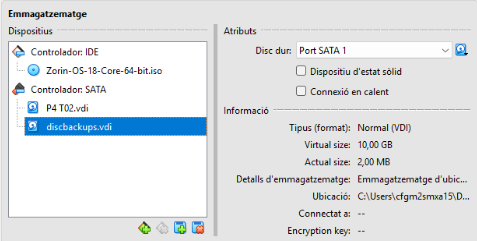

<hr style="border:0.5px solid #ccc;" />

Quan accedim a la màquina, podem comprovar amb ``lsblk`` que el disc addicional està sent detectat.

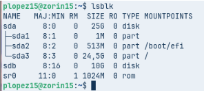

> Nota important: Si no tenim fdisk haurem d’instal·lar-lo amb ``sudo apt install fsdisk``

<hr style="border:0.5px solid #ccc;" />

Crearem una nova partició al disc addicional ``sdb`` utilitzant la comanda següent. Aquesta acció ens permetrà definir un espai d’emmagatzematge independent dins del disc que després podrem formatar i muntar per utilitzar-lo com a unitat auxiliar.

```bash
sudo fdisk /dev/sdb
```` 

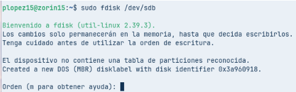

<hr style="border:0.5px solid #ccc;" />

Un cop aparegui el menú, seguirem les següents instruccions:

- ``n`` → Crear una nova partició

- ``p`` → Definir-la com a partició primària

- ``Enter`` → Acceptar el número de partició per defecte

- ``Enter`` → Acceptar el primer sector per defecte

- ``Enter`` → Acceptar l’últim sector per defecte

- ``w`` → Guardar els canvis i sortir del menú

Així, la nova partició quedarà creada i llesta per ser formatada i muntada.


<hr style="border:0.5px solid #ccc;" />

Si tornem a executar ``lsblk`` podrem veure apareixent una nova partició, que correspon a la que acabem de crear.

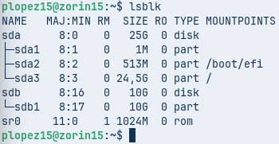

<hr style="border:0.5px solid #ccc;" />

Abans de formatejar el disc en format XFS, primer hem d’instal·lar el suport per a XFS amb la comanda següent:

```bash
sudo apt install xfsprogs -y
```

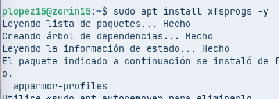

<hr style="border:0.5px solid #ccc;" />

Ara, un cop instal·lat el suport per a XFS, ja podem formatar la partició amb la comanda corresponent.

```bash
sudo mkfs.xfs /dev/sdb1
```

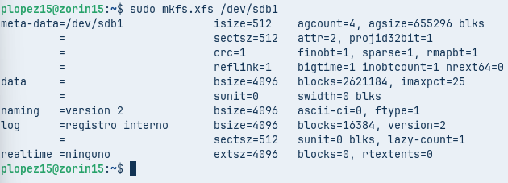

<hr style="border:0.5px solid #ccc;" />

A continuació, crearem una carpeta i muntarem la partició en aquesta:

```bash
sudo mkdir -p /media/backup 
sudo mount /dev/sdb1 /media/backup
```
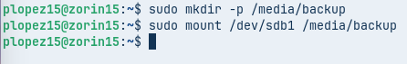

<hr style="border:0.5px solid #ccc;" />

Podem verificar que la partició s’ha muntat correctament amb la comanda:
```bash
df -h | grep backup
```


<hr style="border:0.5px solid #ccc;" />

A continuació, instal·larem Duplicity, l’eina que ens permetrà automatitzar les còpies de seguretat.

```bash
sudo apt install duplicity -y 
```


<hr style="border:0.5px solid #ccc;" />

Podem comprovar que Duplicity s’ha instal·lat correctament amb: ``duplicity –version``

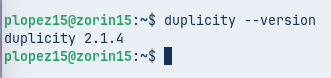

<hr style="border:0.5px solid #ccc;" />

Crearem dos usuaris nous, assegurant-nos que cadascun tingui un directori personal:

```bash
sudo adduser usuari1 
sudo adduser usuari2
```

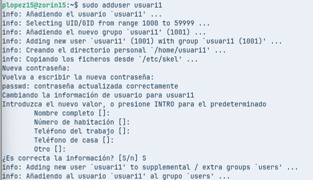

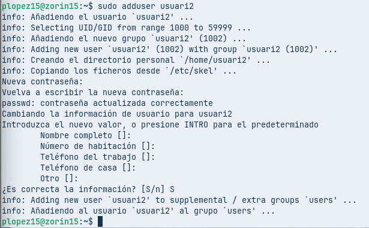

<hr style="border:0.5px solid #ccc;" />

Ara crearem quatre fitxers de 10 MB cadascun dins del directori que hem creat anteriorment.

```bash
for i in 1 2 3 4; do sudo dd if=/dev/zero of=fitxer$i bs=1M count=10; done
```

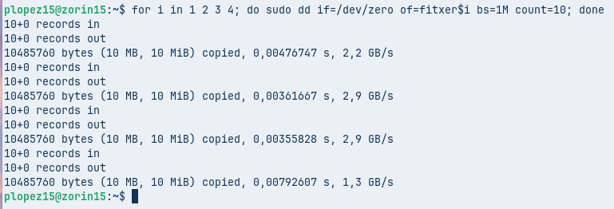

I podem verificar la creació dels fitxers amb: ``ls -lh``

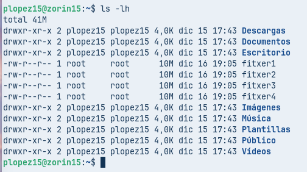

<hr style="border:0.5px solid #ccc;" />

Crearem la còpia de seguretat amb Duplicity. Durant el procés, se’ns demanarà una passphrase (contrasenya), que s’utilitzarà per xifrar les dades.

```bash
sudo duplicity /home file:///media/backup/home-backup
```

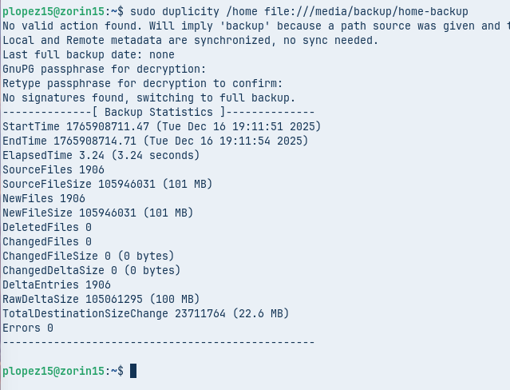

<hr style="border:0.5px solid #ccc;" />

Un cop finalitzat el procés, podrem observar els fitxers de la còpia de seguretat al directori de destinació.

```bash
ls /media/backup/home-backup/
```

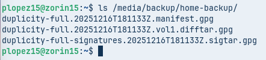

<hr style="border:0.5px solid #ccc;" />


A continuació, esborrarem els fitxers de prova creats anteriorment per verificar si Duplicity pot restaurar-los correctament, i podem comprovar la seva eliminació amb: ``ls``

```bash
sudo rm fitxer1 fitxer2 fitxer3 fitxer4 
```


<hr style="border:0.5px solid #ccc;" />

Ara restaurarem els fitxers utilitzant Duplicity.

```bash
sudo duplicity restore file:///media/backup/home-backup /home/restored 
```

I si executem:

```bash
ls /home/restored/usuari
```

Podrem veure que els fitxers s’han restaurat correctament i tornen a estar disponibles.

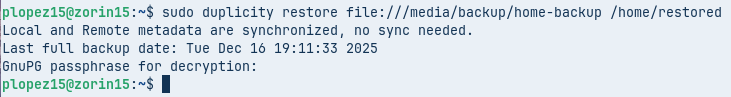

<hr style="border:0.5px solid #ccc;" />

Ara afegirem un fitxer nou i generarem una còpia de seguretat incremental. Tot seguit, podem comprovar els fitxers i les seves mides amb: ``ls -lh``

```bash
sudo dd if=/dev/zero of=fitxer_nous bs=1M count=4 
```

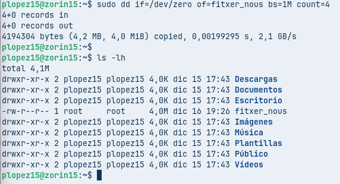

<hr style="border:0.5px solid #ccc;" />

Executarem la mateixa comanda que abans per generar la còpia de seguretat.

```bash
sudo duplicity /home file:///media/backup/home-backup
```

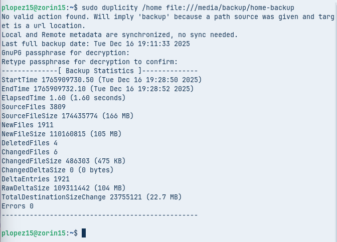

<hr style="border:0.5px solid #ccc;" />


Podem consultar la informació del backup amb la comanda corresponent de Duplicity:

```bash
sudo duplicity collection-status file:///media/backup/home-backup
```

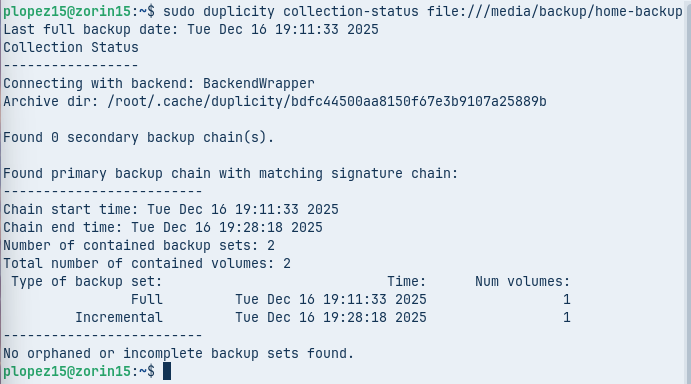

<hr style="border:0.5px solid #ccc;" />


Ara desemontem la unitat:

```bash
sudo umount /media/backup
```

I comprovem que ja no està muntada:

```bash
df -h | grep backup
```

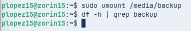

<hr style="border:0.5px solid #ccc;" />

Ara automatitzarem tot aquest procés amb un script. Obrim l’arxiu:

```bash
sudo nano /root/fullbackup.sh
```

I afegim el següent contingut:

```bash
#!/bin/bash 
mount /dev/sdb1 /media/backup 
export PASSPHRASE="contrasenya" 
duplicity full /home file:///media/backup/home-backup 
unset PASSPHRASE 
umount /media/backup
```

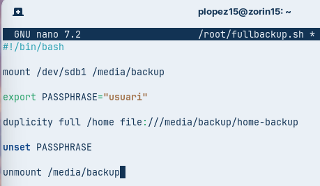

<hr style="border:0.5px solid #ccc;" />

Ara donem permisos d’execució a l’script:

```bash
sudo chmod +x /root/fullbackup.sh
```

I el provem manualment

```bash
sudo /root/fullbackup.sh
```


Si no apareixen errors, l’script funciona correctament.

<hr style="border:0.5px solid #ccc;" />

A continuació, programem la seva execució automàtica amb cron. Obrim el fitxer de crontab:

```bash
0 23 * * 0 /root/fullbackup.sh
```


<hr style="border:0.5px solid #ccc;" />

Finalment, podem verificar que els canvis s’han guardat correctament amb:


<hr style="border:0.5px solid #ccc;" />


Ara crearem un altre script iugal al d'abans, però que realitzarà còpies incrementals. Així que obrim un nou fitxer:

```bash
sudo nano /root/incrementalbackup.sh
```


<hr style="border:0.5px solid #ccc;" />

Tornem a donar com abans permisos d’execució a l’script

```bash
sudo chmod +x /root/incrementalbackup.sh
```

I el provem manualment

```bash
sudo /root/incrementalbackup.sh
```


<hr style="border:0.5px solid #ccc;" />

Ara afegim aquest script al cron també, tornem com a root a crontab amb ``sudo contrab -e`` 

I, a sota de la línia anterior, afegim:

I a sota de la línia anterior, afegim:
```bash
0 23 * * 1-6 /root/incrementalbackup.sh
```


<hr style="border:0.5px solid #ccc;" />
