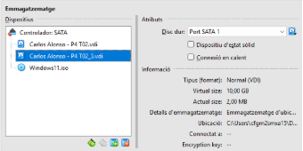

## T02: DPR: còpies de seguretat

## Part 1: Còpia seguretat dels equips clients Windows

### 1. Introducció
Aquesta guia descriu com protegir la informació de l’ordinador Windows del director mitjançant una política de còpies de seguretat basada en el model 3-2-1. El sistema combina una còpia local al disc secundari de l’equip i una còpia externa al núvol a través de Google Drive utilitzant Duplicati.

L’objectiu és garantir que les dades més importants de l’usuari —especialment els fitxers de Documents— estiguin sempre disponibles i es puguin recuperar fàcilment en cas d’error, pèrdua o eliminació accidental.

---

### 2. Requisits previs
Per dur a terme la configuració, es treballarà amb una màquina virtual amb Windows 11 que disposa de dos discs durs:
- Disc principal, on s’instal·la el sistema operatiu.
- Disc secundari de 10 GB, formatat en NTFS i utilitzat com a unitat addicional (per exemple, D:).

A més, cal disposar d’un compte personal de Google amb accés a Google Drive, un usuari local de Windows per gestionar l’equip i connexió a Internet, necessària tant per instal·lar Duplicati com per sincronitzar les còpies de seguretat amb el núvol.

#### 2.1 Creació i assignació del disc secundari
1. Apaga la màquina virtual
 Els canvis d’emmagatzematge s’han de fer amb la VM tancada.

2. Accedeix a la configuració de la màquina
 Menú: Configuració → Emmagatzematge

3. Crea el disc dur virtual nou
   - Capacitat: 10 GB
   - Format: VDI (o equivalent segons el programari de virtualització)
   - Associa’l a un controlador SATA per obtenir millor rendiment.

#### 2.2 Inicialitzar i formatar el disc nou
1. Obre l’eina de gestió de discs

   Prem Win + R, escriu diskmgmt.msc i confirma amb Enter.

2. Identifica el disc afegit
   A la llista apareixerà com a No assignat (per exemple, Disc 1).

3. Crea el volum
   Fes clic dret sobre l’espai No assignat i selecciona Nou volum simple….
   Accepta el tamany predeterminat i continua amb Següent.

4. Assigna una lletra de unitat
   Pots utilitzar la lletra que vulguis (l’exemple habitual és D:).
   Prem Següent.
