## T02: DPR: còpies de seguretat

## Part 1: Còpia seguretat dels equips clients Windows

### 1. Introducció
Aquesta guia descriu com protegir la informació de l’ordinador Windows del director mitjançant una política de còpies de seguretat basada en el model 3-2-1. El sistema combina una còpia local al disc secundari de l’equip i una còpia externa al núvol a través de Google Drive utilitzant Duplicati.

L’objectiu és garantir que les dades més importants de l’usuari —especialment els fitxers de Documents— estiguin sempre disponibles i es puguin recuperar fàcilment en cas d’error, pèrdua o eliminació accidental.

---

### 2. Requisits previs
Per dur a terme la configuració, es treballarà amb una màquina virtual amb Windows 11 que disposa de dos discs durs:
- Disc principal, on s’instal·la el sistema operatiu.
- Disc secundari de 10 GB, formatat en NTFS i utilitzat com a unitat addicional (per exemple, D:).


A més, cal disposar d’un compte personal de Google amb accés a Google Drive, un usuari local de Windows per gestionar l’equip i connexió a Internet, necessària tant per instal·lar Duplicati com per sincronitzar les còpies de seguretat amb el núvol.


<hr style="border:0.5px solid #ccc;" />

#### 2.1 Creació i assignació del disc secundari
1. Apaga la màquina virtual
 Els canvis d’emmagatzematge s’han de fer amb la VM tancada.

2. Accedeix a la configuració de la màquina
 Menú: Configuració → Emmagatzematge

3. Crea el disc dur virtual nou
   - Capacitat: 10 GB
   - Format: VDI (o equivalent segons el programari de virtualització)
   - Associa’l a un controlador SATA per obtenir millor rendiment.

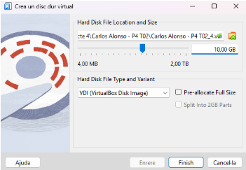

<hr style="border:0.5px solid #ccc;" />

#### 2.2 Inicialitzar i formatar el disc nou
1. Obre l’eina de gestió de discs > Prem Win + R, escriu diskmgmt.msc i confirma amb Enter.

2. Identifica el disc afegit > A la llista apareixerà com a No assignat (per exemple, Disc 1).

3. Crea el volum > Fes clic dret sobre l’espai No assignat i selecciona Nou volum simple…. > Accepta el tamany predeterminat i continua amb Següent.

4. Assigna una lletra de unitat > Pots utilitzar la lletra que vulguis (l’exemple habitual és D:). > Prem Següent.

5. Defineix el sistema de fitxers
- Sistema de fitxers: NTFS
- Activa l’opció Format ràpid > Continua amb Següent i finalitza el procés.

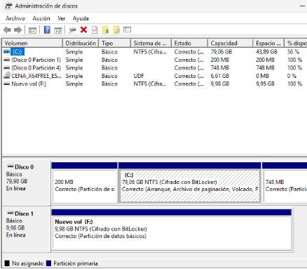

<hr style="border:0.5px solid #ccc;" />

#### 2.3 Crear la carpeta de destinació
1. Obre l’Explorador de fitxers de Windows.

2. Accedeix a la unitat que hagis assignat al disc nou (en el meu cas, F:).

3. Crea una carpeta per guardar-hi les còpies locals, amb el nom o ruta que prefereixis.
Exemple utilitzat en aquesta guia: ``BackupsDuplicati\Local``

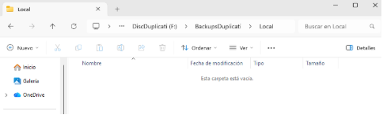

---

### 3. Instal·lació de Duplicati

Accedeix al lloc web oficial de Duplicati
Ves a la pàgina de descàrrega: https://www.duplicati.com/download

Baixa la versió adequada per al teu sistema
Selecciona la versió estable per a Windows i descarrega el fitxer d’instal·lació.

Instal·la l’aplicació > Obre el fitxer descarregat i segueix l’assistent:
- Accepta les condicions de llicència.
- Tria l’opció Install for all users.
- Activa Start Duplicati automatically when Windows starts perquè l’eina s’executi en iniciar el sistema.

Quan el procés acabi, Duplicati quedarà instal·lat com a servei i s’obrirà automàticament al navegador.

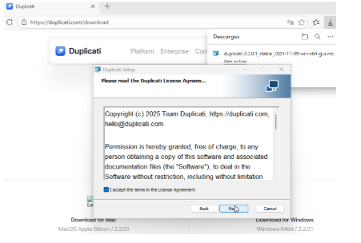

--- 
### 4. Configuració del backup local (disc secundari)
#### 4.1. Creació d’una nova còpia de seguretat
Accedeix a la interfície web de Duplicati.

A la pantalla inicial, selecciona **Add backup** i tria l’opció **Configure a new backup.**

#### Pas 1: General
- Nom del backup: indica el nom que vulguis identificar la còpia. (En aquesta guia s’utilitza Còpia a mode d’exemple.)

- Contrasenya: crea una contrasenya segura; és necessària per poder restaurar les dades més endavant.

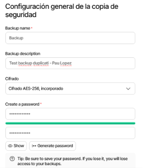

<hr style="border:0.5px solid #ccc;" />

#### Pas 2: Destinació
- Tipus de destinació: selecciona File system (local path or network share).

- Ruta de la carpeta: indica el directori on vols guardar la còpia local.
 Exemple utilitzat en aquesta guia: D:\Backups\Local

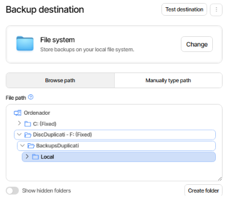

<hr style="border:0.5px solid #ccc;" />

#### Pas 3: Fonts
Selecciona les carpetes que vols incloure al backup.

Per a aquest exemple, obre l’opció C: i tria la ruta:
```bash
C:\Users\Pau\Documents
```
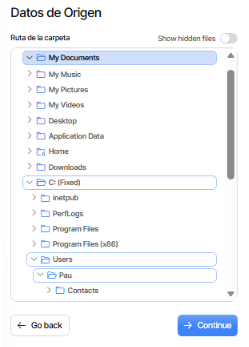

<hr style="border:0.5px solid #ccc;" />

#### Pas 4: Programació
- Activa l’opció Automatically run backups per permetre que la còpia s’executi de manera automàtica.
- Prem Continue per passar al següent apartat.

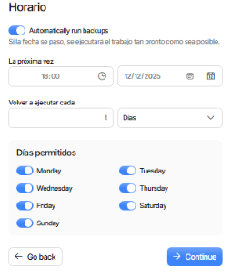

<hr style="border:0.5px solid #ccc;" />

#### Pas 5: Opcions de còpia
En aquesta secció pots definir el comportament de la còpia de seguretat, escollint el tipus de backup i ajustant els paràmetres segons les teves necessitats.

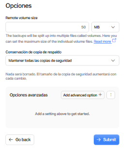

<hr style="border:0.5px solid #ccc;" />

Un cop hagis completat tots els passos de configuració, la pantalla final hauria de mostrar la vista resum del backup amb tots els paràmetres definits correctament.

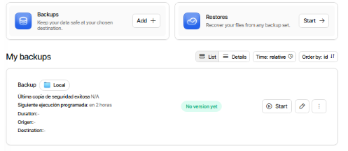

---

### 5. Configuració del backup al núvol (Google Drive)
#### 5.1. Preparació a Google Drive
  1. Inicia sessió al teu compte personal de Google.
  2. A Google Drive, crea una carpeta destinada a guardar-hi les còpies de seguretat.
´´  
Exemple utilitzat en aquesta guia: Backups_duplicati
´´

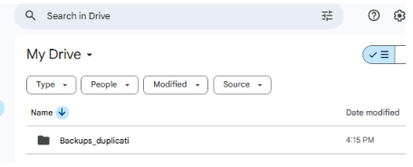

<hr style="border:0.5px solid #ccc;" />

#### 5.2. Creació del backup a Duplicati
A Duplicati, tornem a clicar “Add backup” → “Configure a new backup”.

**General**
- Add backup → Configure a new backup
- Nom: qualsevol (exemple: Backup_Drive)
- Contrasenya: la mateixa que al backup local

**Destinació**
- Tipus: Google Drive
- Inicia sessió amb el compte personal
- Indica la carpeta de Drive
- Obtingues l’Auth ID des de l’enllaç que mostra Duplicati

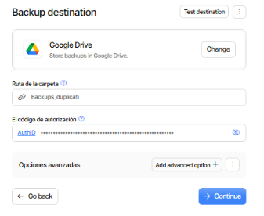

<hr style="border:0.5px solid #ccc;" />

**Fonts**
Obre My documents i selecciona:
``
C:\Users\Pau\Documents
``

**Programació**
- Activa Automatically run backups
- Programa una execució diària a les 18:00
- Prem Continue

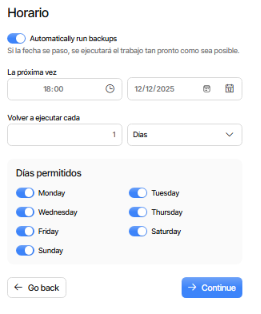

--- 

### 6. Prova de concepte
1. Crear fitxers de prova
 - Afegeix alguns arxius a:
 - C:\Users\Pau\Documents > (exemple: informe_secret.txt)

2. Executar els backups manualment
 A Duplicati, utilitza el botó Run now en tots dos backups (local i núvol).

3. Verificacions
- A D:\BackupsDuplicati\Local, comprova que hi apareixen fitxers .duplicati-*
- A Google Drive, dins la carpeta configurada (exemple: Duplicati_Backups), confirma que s’han pujat còpies.

4. Simulació de pèrdua de dades
Esborra tot el contingut de la carpeta Documents per preparar la prova de restauració.

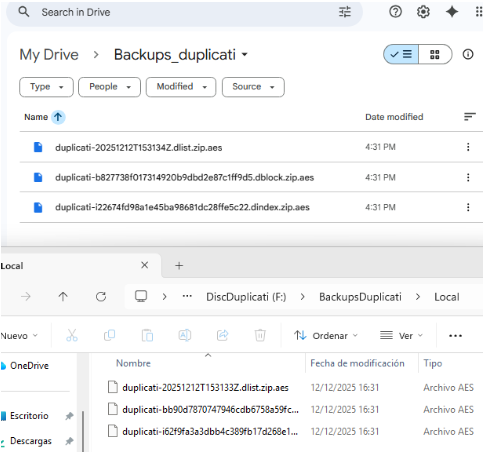

---

### 7. Restauració de dades
#### 7.1. Restauració des del disc local
1. A Duplicati, obre el backup que hem creat abans i prem Restore.

2. Indica la destinació de recuperació:
 - C:\Users\Pau\Documents

3. Clica Restore i verifica que els fitxers recuperats siguin correctes.

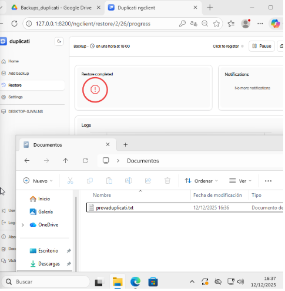

<hr style="border:0.5px solid #ccc;" />

#### 7.2. Restauració des de Google Drive
1. A Duplicati, selecciona Backup_Drive
2. Si ho sol·licita, torna a autenticar-te amb el compte de Google.
3. Defineix la carpeta de recuperació: Backups_duplicati
4. Comprova que els fitxers restaurats siguin correctes i complets.

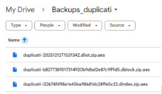

---

### 8. Conclusió
Amb aquesta configuració hem creat un sistema de còpies de seguretat que funciona de manera fiable i senzilla. La còpia local al disc secundari permet recuperar fitxers ràpidament si s’esborren per error, i la còpia al núvol garanteix que la informació continuarà segura encara que l’ordinador tingui un problema greu.

Les proves realitzades —crear arxius, executar els backups i restaurar-los— demostren que tant el disc local com Google Drive responen correctament. En un cas real, si l’usuari perdés un document important, només hauria d’obrir Duplicati i seleccionar “Restore” per recuperar-lo en pocs segons.

En resum: el sistema és fàcil de mantenir, protegeix les dades de manera eficient i assegura que qualsevol fitxer es pot recuperar quan calgui.
