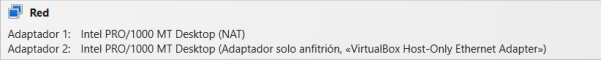

## T05: Accés Remot - Connexió via SSH

Per a aquesta pràctica necessitarem dues interfícies de xarxa: NAT i Adaptador només
amfitrió


Per instal·lar SSH, primer actualitzem el sistema amb: 
```bash 
sudo apt upgrade && sudo apt update
```


