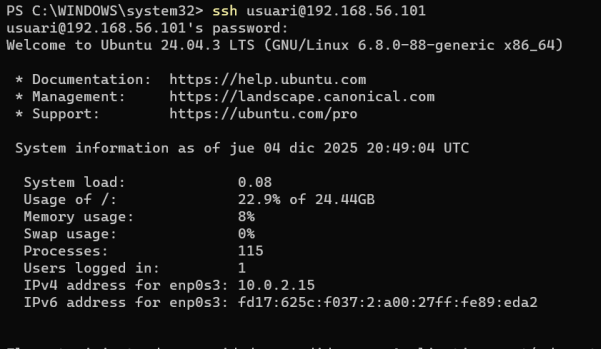
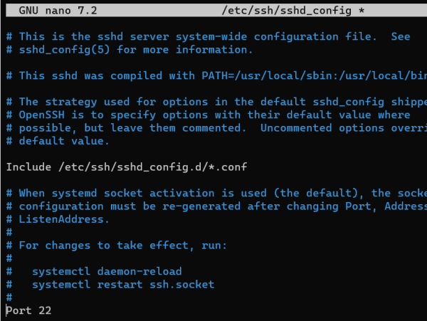
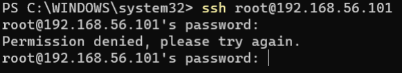
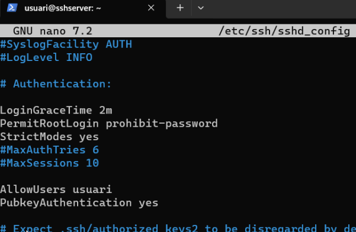
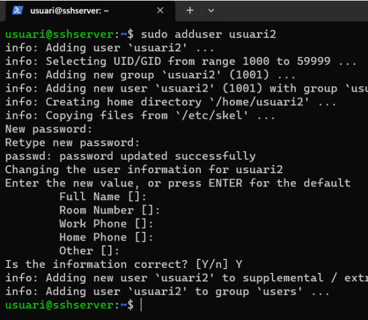
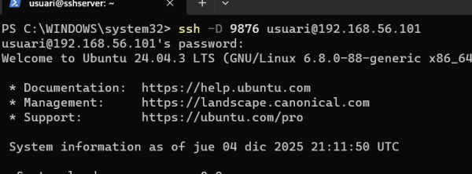
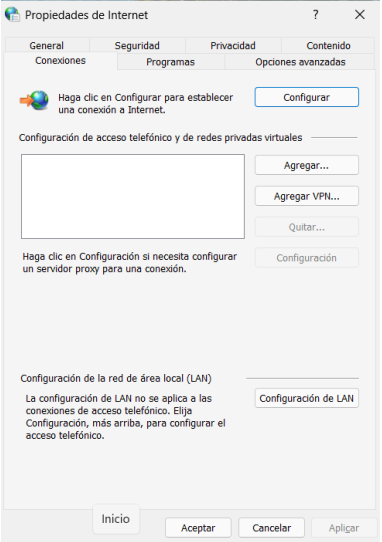
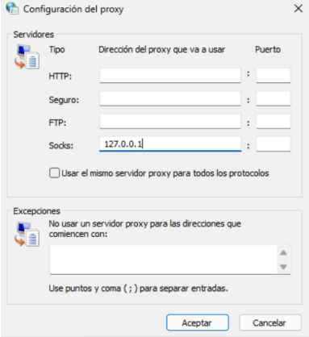
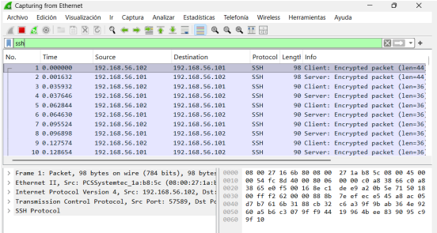
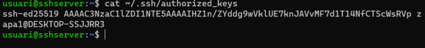

## T05: Accés Remot - Connexió via SSH

Per a aquesta pràctica necessitarem dues interfícies de xarxa: NAT i Adaptador només
amfitrió


---

Per instal·lar SSH, primer actualitzem el sistema amb: 
```bash 
sudo apt upgrade && sudo apt update
```


---

Un cop hagin acabat l’update i l’upgrade, ja podem instal·lar SSH.
```bash 
sudo apt install ssh -y
```


---

És molt important iniciar el servei SSH i comprovar-ne l’estat. Per això fem:
```bash 
sudo systemctl start ssh
sudo systemctl status ssh
```


---

Quan tinguem el client Windows obert, haurem d’entrar a PowerShell per connectar-nos al
nostre servidor mitjançant SSH amb la comanda corresponent.
```bash 
ssh usuari@[IP del servidor del adaptador host-only]
```
En el meu cas, la comanda seria:
```bash 
ssh usuari@192.168.56.101
```


---

Per comprovar que estem treballant via SSH des del nostre Ubuntu, podem utilitzar la
comanda:
```bash 
hostname
```


---
Per desactivar l’ús de root en connexions SSH i tenir més seguretat, haurem d’editar l’arxiu
**/etc/ssh/sshd_config**

Traiem el # de la línia Port 22



I també eliminem el # d’aquestes 4 opcions


---

Amb aquesta configuració indiquem que el port de connexió és el 22 i que no permetem
connexions com a root.


---

Ara creem una llista d’usuaris autoritzats per SSH modificant l’arxiu anterior i afegint la línia
corresponent. Els usuaris s’han d’escriure separats per comes.
```bash 
AllowUsers (nomusuari)
```


Perquè s’apliquin els canvis, hem d’executar:
```bash 
sudo systemctl restart ssh
```
Si no reiniciem el servei, encara ens podria deixar entrar amb un altre usuari.

---

Per comprovar-ho, crearem un nou usuari (usuari2) i intentarem connectar-nos per SSH.



Com a resultat, obtindrem un accés denegat.

Actualment, tot el trànsit del client es canalitza a través del servidor. Però, si volem habilitar
una redirecció dinàmica, haurem de connectar-nos modificant lleugerament la comanda
d’SSH. 
```bash 
ssh -D 9876 usuari@192.168.56.101
```



---

Ara configurarem un túnel SOCKS



---

Desactivem les dues opcions de configuració automàtica i activem l’opció de servidor proxy


---

Després accedim a Opciones avanzadas i modifiquem la configuració dels SOCKS



---

Amb wireshark comprovem que tot el trànsit que generem s’envia per SSH al servidor.
Podem veure que entre 127.0.2.7 (CLIENT) i 192.168.56.101 (SERVIDOR) hi han
comunicacions


---

Ara veurem com connectar-nos per SSH sense introduir la contrasenya. Per fer-ho, primer
hem de generar una clau pública SSH amb les següents comandes
Per crear la key fem:
```bash 
ssh-keygen -t ed25519
```
I per veure-la:
```bash 
type $env:USERPROFILE\.ssh\id_ed25519.pub
# Molt important fer Ctrl + C perquè la necessitarem despres
```


---

Ara des del servidor crearem un directori on només el propietari tingui permisos, on
guardarem la key a authorized_keys.

Comandes a seguir en ordre:
```bash 
mkdir -p ~/.ssh
sudo chmod 700 ~/.ssh
sudo nano ~/.ssh/authorized_keys # En aquest arxiu enganxarem la key que hem generat i hem copiat anteriorment
cat ~/.ssh/authorized_keys
sudo chmod 600 ~/.ssh/authorized_keys
```


---

Ara ens podem connectar sense haver introduït manualment la contrasenya.
```bash 
ssh -i $env:USERPROFILE\.ssh\id_ed25519 usuari@192.168.56.101
```



---
