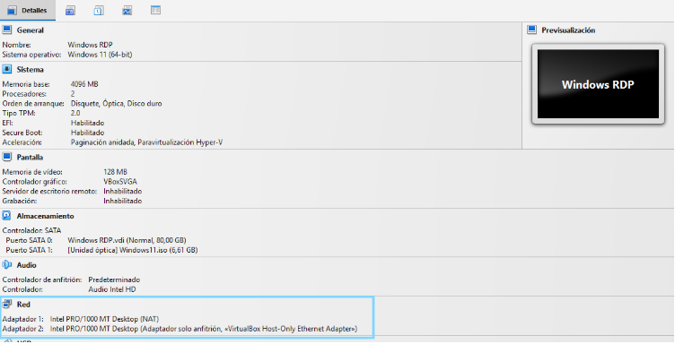
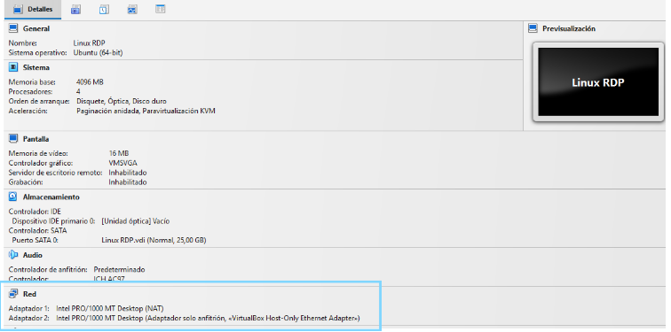
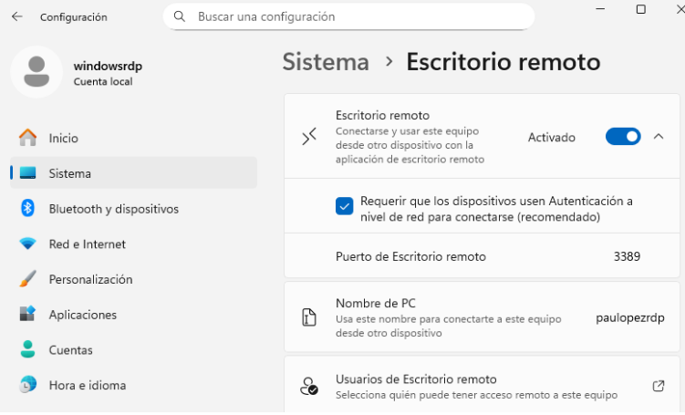

## T05: Accés Remot - Escriptori remot (RDP)

### Fase 1 – Preparació de l’Entorn
Primer, cal instal·lar i configurar les dues màquines, tant la de Windows com la de Zorin. Un punt important és la configuració de xarxa: a cada màquina haurem d’afegir dos adaptadors, un en mode NAT (per garantir connexió a Internet) i un en mode Xarxa d’Amfitrió (per permetre que ambdues màquines es puguin comunicar entre si).





---

### Fase 2 - Configuració i Seguretat del Servei SSH
A continuació, accedirem a la configuració de **Escritorio Remoto.** Allà activarem la primera opció. Un cop activada, es mostrarà el nom del nostre equip, informació que necessitarem més endavant per completar la configuració.



<hr style="border:0.5px solid #ccc;" />

Quan ja tinguem l’opció activada i coneguem el nom del nostre ordinador, entrarem a la tercera opció que apareixia a la imatge: “Usuarios de escritorio remoto”. Aquest apartat serveix per indicar quins usuaris tindran permís per connectar-s’hi.
Aquí hi afegirem els usuaris de les dues màquines. En el cas de combinar un usuari de Windows amb un de Linux, ho escriurem d’aquesta manera:
```bash
USUARIWINDOWS\usuarilinux
```
