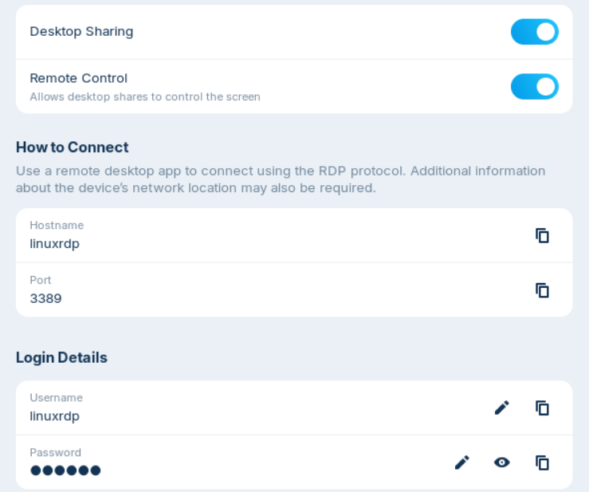
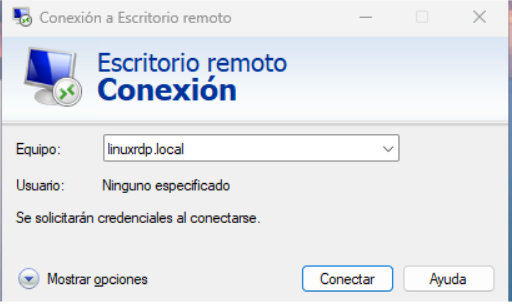
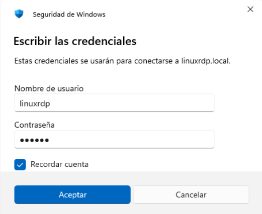
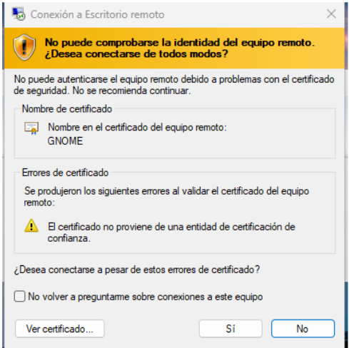
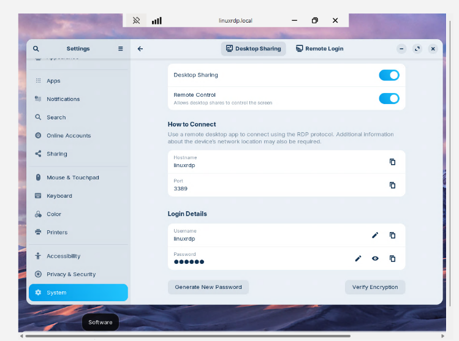

## T05: Accés Remot - Escriptori remot (RDP)

### Fase 1 – Preparació de l’Entorn
Primer, cal instal·lar i configurar les dues màquines, tant la de Windows com la de Zorin. Un punt important és la configuració de xarxa: a cada màquina haurem d’afegir dos adaptadors, un en mode NAT (per garantir connexió a Internet) i un en mode Xarxa d’Amfitrió (per permetre que ambdues màquines es puguin comunicar entre si).


---

### Fase 2 - Configuració i Seguretat del Servei SSH
A continuació, accedirem a la configuració de **Escritorio Remoto.** Allà activarem la primera opció. Un cop activada, es mostrarà el nom del nostre equip, informació que necessitarem més endavant per completar la configuració.


<hr style="border:0.5px solid #ccc;" />

Quan ja tinguem l’opció activada i coneguem el nom del nostre ordinador, entrarem a la tercera opció que apareixia a la imatge: “Usuarios de escritorio remoto”. Aquest apartat serveix per indicar quins usuaris tindran permís per connectar-s’hi.

Aquí hi afegirem els usuaris de les dues màquines. En el cas de combinar un usuari de Windows amb un de Linux, ho escriurem d’aquesta manera:
```bash
USUARIWINDOWS\usuarilinux
```


<hr style="border:0.5px solid #ccc;" />

Quan haguem afegit l’usuari a la màquina Windows, aquesta part quedarà configurada de moment. Ara passarem al Zorin. Obrirem l’aplicació “Remmina”, que ja ve instal·lada per defecte. Remmina és, en essència, el client d’escriptori remot que utilitza Linux. 

Un cop dins l’aplicació, al cercador de la part superior —com es veu a la imatge— escriurem el nom del PC de Windows, afegint-hi “.local” al final. En el meu cas, per exemple, l’adreça que he introduït és:
```bash
paulopezrdp.local
```


<hr style="border:0.5px solid #ccc;" />

A continuació, apareixerà una finestra emergent amb les credencials RDP. Aquí haurem d’introduir l’usuari i la contrasenya corresponents al PC de Windows. Un cop feta l’autenticació, simplement premem “OK” per continuar.


<hr style="border:0.5px solid #ccc;" />

Si hem completat tots els passos de manera correcta, la connexió remota s’establirà sense problemes i podrem accedir i utilitzar l’ordinador al qual ens estem connectant. A la imatge es pot veure que apareix “windowsrdp”, cosa que confirma que hem entrat al PC correcte i que la connexió s’ha configurat satisfactòriament.


---

### Fase 3 – Connexió des de Windows
Després d’haver establert la connexió de Zorin cap a Windows, passarem a la segona part, que consisteix a fer el procés invers: connectar-nos des de Windows al Zorin.

Per començar, obrirem la Configuració del Zorin i anirem a Sistema. Allà activarem les dos primeres opcions “Escriptori compartit” i “Control remot”. Cal tenir en compte que Zorin genera una contrasenya automàtica. És recomanable substituir-la per una contrasenya pròpia.



<hr style="border:0.5px solid #ccc;" />

Un cop tinguem les opcions activades i la contrasenya modificada, passarem a Windows. Allà cercarem l'aplicació “Conexió a Escriptori Remot”. No caldrà modificar cap configuració, ja que es detectarà automàticament. Simplement premem “Connectar”.

En aquest punt, haurem d’introduir el hostname del nostre sistema Linux, afegint-hi “.local” al final. Per exemple:
```bash
nomlinux.local
```
És molt important reiniciar perquè tots els canvis es guardin i s’apliquin correctament.



<hr style="border:0.5px solid #ccc;" />

A continuació, el sistema ens sol·licitarà les credencials del compte de Linux que hem modificat abans (L'usuari per defecte i la contrasenya aleatòria que hem recomenat substituir-la). Això és necessari perquè pugui validar que la connexió es fa de manera segura i que estem accedint a un equip propi o d’un client, i no a un dispositiu desconegut.



<hr style="border:0.5px solid #ccc;" />

Després d’introduir les credencials de l’usuari de Windows, el sistema ens preguntarà si volem acceptar el certificat. És un pas equivalent al que ja vam fer anteriorment amb el Zorin. En aquest cas, seleccionarem “Sí” i marcarem l’opció perquè no torni a mostrar aquest avís en futures connexions.



<hr style="border:0.5px solid #ccc;" />

Quan hàgim acceptat el certificat i completat tots els passos correctament, la connexió remota de Windows cap a Zorin hauria de funcionar sense problemes. Tal com es mostra a la captura, podem veure la sessió de Zorin executant-se des del meu Windows mitjançant l’eina de Connexió Remota.



---

### Fase 4 - Conclusió
A través d’aquesta pràctica hem pogut configurar i entendre el funcionament de les connexions remotes entre sistemes operatius diferents, en aquest cas Windows i Zorin OS. Hem comprovat com, aplicant una correcta configuració de xarxa, permisos d’usuari i eines de connexió remota, és possible accedir i controlar un equip extern de forma segura i eficient.

El procés s’ha dividit en dues parts: primer Zorin → Windows i posteriorment Windows → Zorin, la qual cosa ens ha permès veure les diferències i similituds entre ambdós sistemes a l’hora de gestionar connexions RDP i VNC. A més, hem après la importància de conceptes com els hostnames, les credencials, els certificats i la necessitat de reiniciar per aplicar configuracions crítiques.

En conjunt, aquesta tasca ens ajuda a entendre una situació molt habitual en l’àmbit professional: el treball remot amb equips propis o de clients. Dominar aquest procés ens permet ser més autònoms, resoldre incidències a distància i millorar el nostre flux de treball en entorns híbrids o completament remots.
