## T10: Servidor impressió Linux. CUPS 

### Escenari de Treball
Màquina 1 (Servidor): Ubuntu Server configurat amb dues interfícies de xarxa: una en mode NAT i una segona en Host-Only.

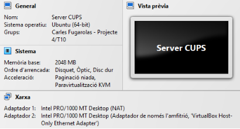

Màquina 2 (Client): Zorin OS (Desktop) configurat amb la mateixa estructura de xarxa que el servidor, utilitzant NAT i Host-Only.

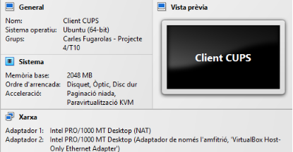

---

### 1. Instal·lació de CUPS al servidor

Abans d’instal·lar CUPS, és necessari actualitzar el sistema operatiu per assegurar-nos que disposem de les últimes versions dels paquets i correccions de seguretat. Això ajuda a evitar possibles incompatibilitats i garanteix una instal·lació més estable del servei.

```bash
sudo apt update -y && sudo apt upgrade -y
```

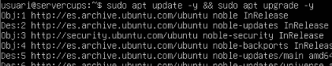

---

Un cop finalitzada l’actualització del sistema, procedim a instal·lar CUPS, ja que és el servei necessari per gestionar les impressores al servidor.

```bash
sudo apt install cups -y
```

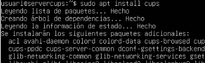

---

### 2. Instal·lar impressora virtual

Per instal·lar la nostra impressora virtual, accedim com a usuari root al client amb ``sudo su`` i instal·lem el paquet cups-pdf, que permet crear una impressora virtual que genera arxius PDF en lloc d’impressions físiques.

```bash
apt install cups-pdf
```


---

### 3. Configuració de l’administració de CUPS i permetre que CUPS escolti per totes les interfícies.

Per permetre l’administració remota de CUPS i que el servei escolti per totes les interfícies de xarxa, és necessari modificar el fitxer de configuració. Abans de fer canvis, és recomanable editar el fitxer amb cura.

Accedim a l’arxiu de configuració amb:
```bash
sudo nano /etc/cups/cupsd.conf
```

---

Un cop dins, modifiquem les següents línies per permetre connexions externes i la detecció d’impressores a la xarxa:
```bash
Listen localhost:631 → Port 631
Browsing No → Browsing On
```

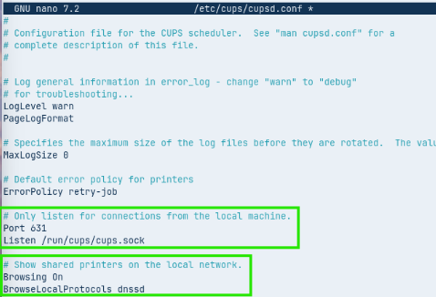

> El resultat final hauria de ser el que es mostra a la imatge, amb el ``Port 631`` configurat perquè CUPS escolti per totes les interfícies i l’opció ``Browsing On`` activada per permetre la detecció d’impressores a la xarxa.

---

Ara, dins del mateix fitxer de configuració, cal permetre l’accés des de la xarxa local al servidor web de gestió de CUPS, ja que per defecte només accepta connexions locals. Això ens permetrà administrar el servei des d’altres equips de la xarxa.

Ho fem aplicant les següents modificacions:

Configuració abans dels canvis    

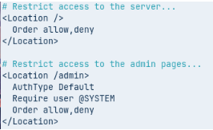

Configuració després dels canvis

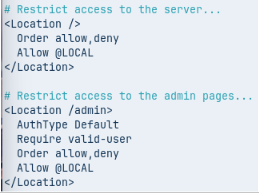

---

Un cop aplicats els canvis al fitxer de configuració, reiniciem el servei de CUPS perquè les modificacions tinguin efecte i comprovem que el servei estigui actiu i funcionant correctament.

```bash
systemctl restart cups && systemctl status cups
```

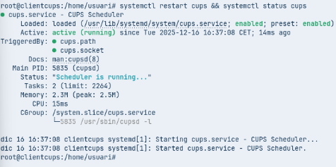

---

### 4. Usant el navegador i el frontal web de CUPS compartir la impressora.

Un cop el servei estigui funcionant, accedim al panell web de gestió de CUPS mitjançant el navegador, ja que és la manera més senzilla d’administrar impressores i configuracions del servidor.
```bash
https://10.0.2.15:631
- 10.0.2.15 > La meva IP del enp0s3
- 631 > El port que hem configurat abans 
```
> És normal que el navegador indiqui que es tracta d’un lloc no segur, ja que CUPS utilitza un certificat autofirmat. En aquest cas, cal accedir a Avanzado → Acceder a 10.0.2.15 (sitio no seguro) per continuar.

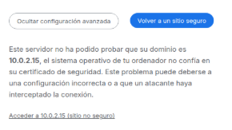

---

Un cop realitzats aquests passos, ja haurem accedit correctament al servei de CUPS i podrem gestionar les impressores des del panell web.

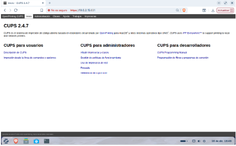

---

### 5. En el Client Zorin afegir la impressora.

A continuació, accedim a l’apartat “Administración”, que es troba a la barra superior d’opcions. Si el navegador torna a mostrar l’avís de seguretat, procedirem de la mateixa manera que abans. En aquest cas, el sistema ens demanarà iniciar sessió amb les credencials del nostre client, ja que es tracta d’una zona d’administració del servei.

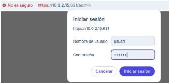

---

Un cop dins del panell d’administració, seleccionarem l’opció “Afegir una impressora” per iniciar el procés de configuració d’una nova impressora al sistema.

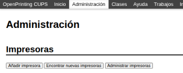

---

Quan hi accedim, no se’ns permetrà realitzar cap acció a causa de la falta de permisos, ja que per defecte CUPS restringeix l’administració a usuaris autoritzats.


---

Per aquest motiu, haurem de tornar a la terminal, entrar com a ``sudo su`` i afegir l’usuari inicial al grup lpadmin, que és el grup amb permisos d’administració de CUPS. 
```bash
usermod -aG ldapmin usuari
id usuari # Per comprovar
```
D’aquesta manera podrem gestionar impressores des del panell web.

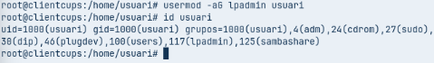

---

I ara, com es pot observar, ja ens permet accedir correctament. A continuació, seleccionem la primera opció, CUPS-PDF, per configurar la impressora virtual.

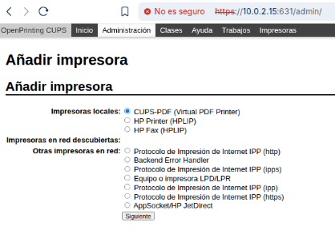

---

A continuació, fem clic a “Siguiente” i procedim a configurar la impressora.

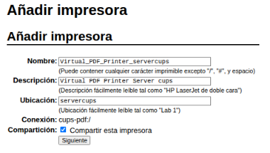

---

Seleccionem la Marca: Generic i el Model: “Generic CUPS-PDF Printer (no options) (en)”, ja que és el controlador adequat per a la impressora virtual CUPS-PDF.

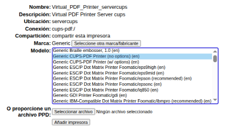

---

Un cop la configuració sigui igual que la mostrada a la imatge, afegim la impressora per finalitzar el procés.

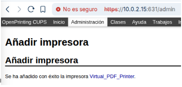

---

Podem comprovar que la impressora ja està disponible si, en utilitzar la barra de cerca, busquem “Impressores” i aquesta apareix correctament configurada.

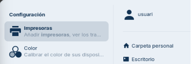

Com podem observar, la nostra impressora virtual ja està disponible i llesta per utilitzar.


---

### 6. Fer una prova de impressió de diversos documents

Llencem diversos treballs d’impressió des del client amb l’objectiu de verificar que la comunicació amb el servidor CUPS funciona correctament. D’aquesta manera, podem comprovar que els treballs s’envien sense errors i que apareixen correctament a la cua d’impressió, indicant que el servei gestiona les peticions de manera adequada.

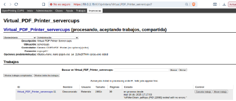

---

### 7. Comprova al server com s’han generat  els arxius pdf corresponents als treballs impresos.

Finalment, comprovem amb la comanda ``ls -all`` que s’ha creat correctament el directori corresponent i que dins hi apareixen els arxius generats pels treballs d’impressió, confirmant que la impressora virtual funciona correctament.

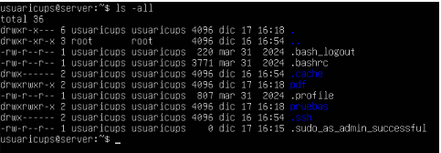

---

Amb aquesta prova de concepte hem pogut comprovar el correcte funcionament del servei CUPS, des de la seva instal·lació i configuració fins a la gestió d’una impressora virtual accessible des del client. Les proves d’impressió realitzades confirmen que la comunicació entre client i servidor és correcta i que els treballs es processen adequadament, validant així la solució implementada.

---

**Gràcies per la teva atenció 📌**

Gràcies per dedicar temps a revisar aquest treball.
Espero que el contingut hagi estat clar, entenedor i útil per comprendre tant el procés seguit com els resultats obtinguts. 🙏


